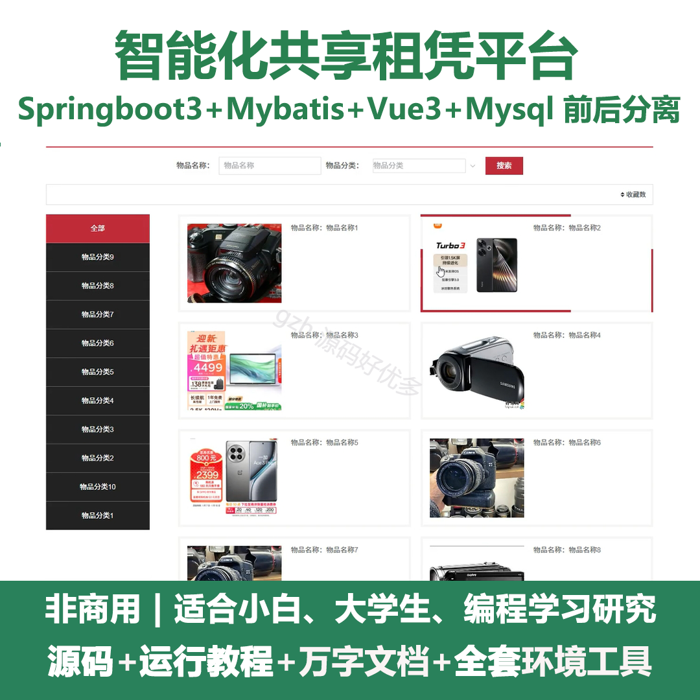
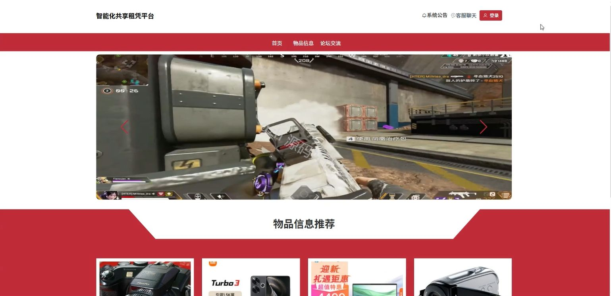
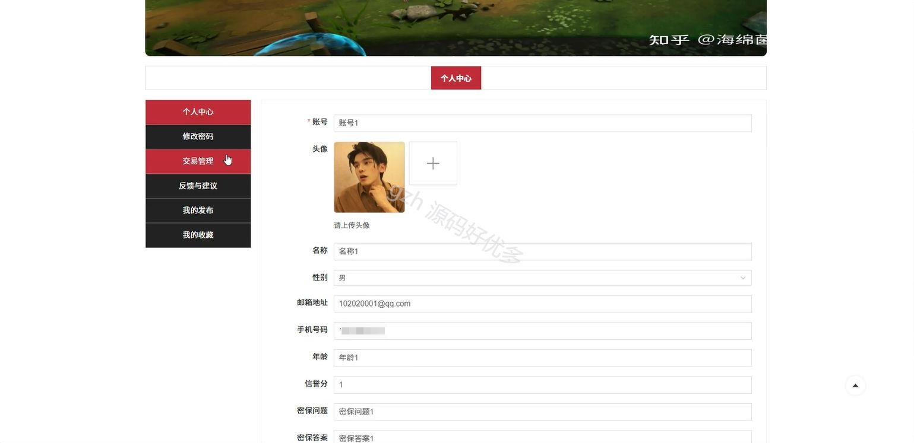
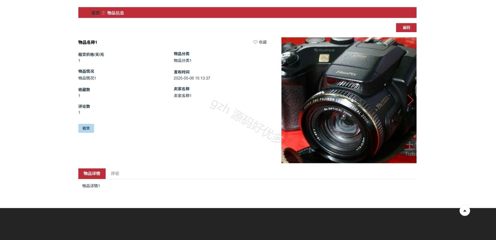
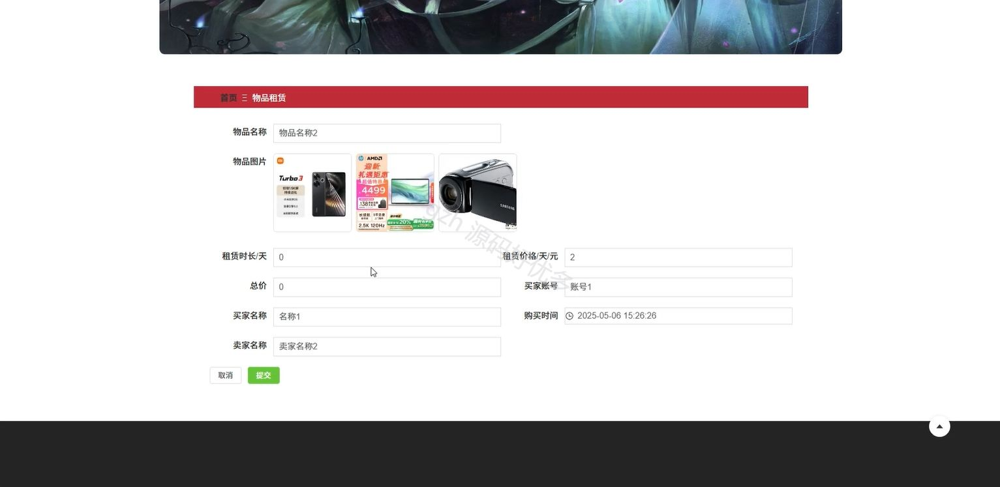
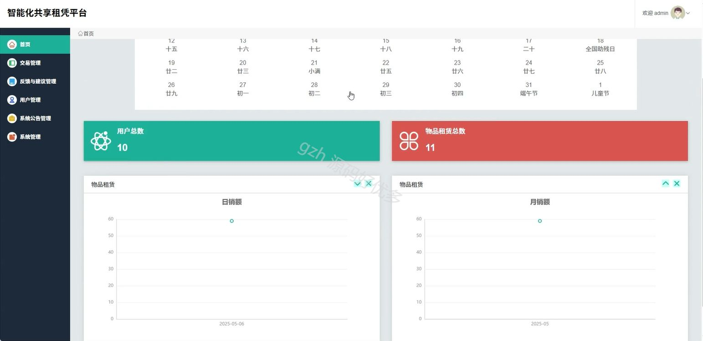
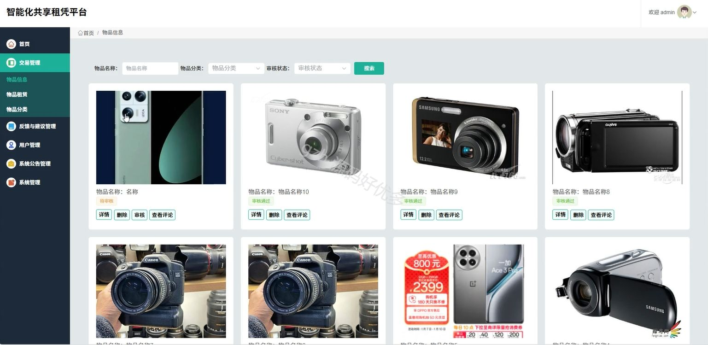
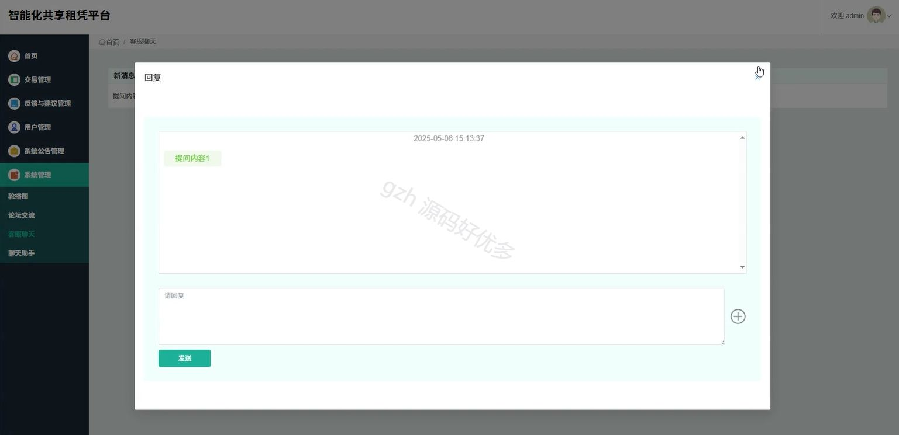
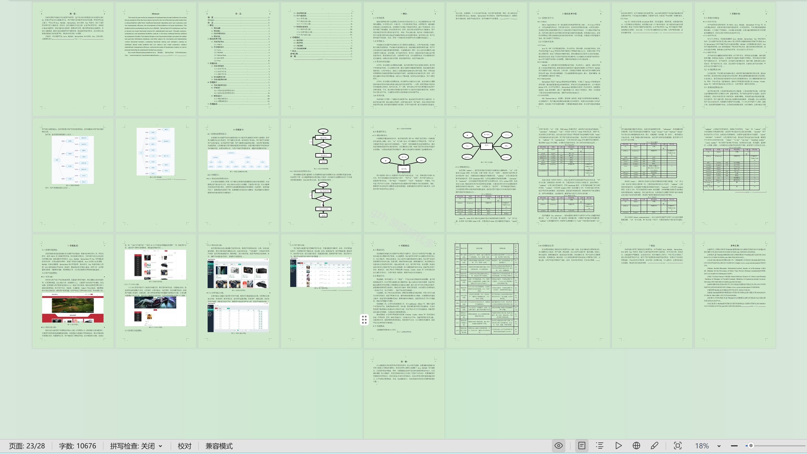

# springbootA504D
springbootA504D智能化共享租凭平台
## 查看主页获取源码

### 一、关键词

交易管理、物品租赁、物品信息

 

### 二、作品包含

源码+数据库+设计文档万字+全套环境和工具资源+部署教程

 

### 三、项目技术

前端技术：Html、Css、Js、Vue3.0、Element-plus
后端技术：Java、SpringBoot3.0、MyBatis

  

 

### 四、运行环境（以下版本亲测，其他版本未知，请自测）

开发工具：IDEA/eclipse  + VSCODE

数据库：MySQL5.7（最低要5.7版本）

数据库管理工具：Navicat10以上版本

环境配置软件： jdk17 + Maven3.6.3

前端Nodejs：20

浏览器：谷歌浏览器

 

### 五、项目介绍

项目编号：springbootA504D

智能化共享租赁平台通过智能技术整合多方租赁资源，实现物品高效共享与便捷租赁，助力降低使用成本并推动绿色消费。

角色：管理员、用户

管理员功能：首页、交易管理、反馈与建议管理、用户管理、系统公告管理、系统管理。

用户功能：首页、物品信息、论坛交流、系统公告、客服聊天、个人中心、修改密码、交易管理、反馈与建议、我的发布、我的收藏。

 

### 六、运行截图

